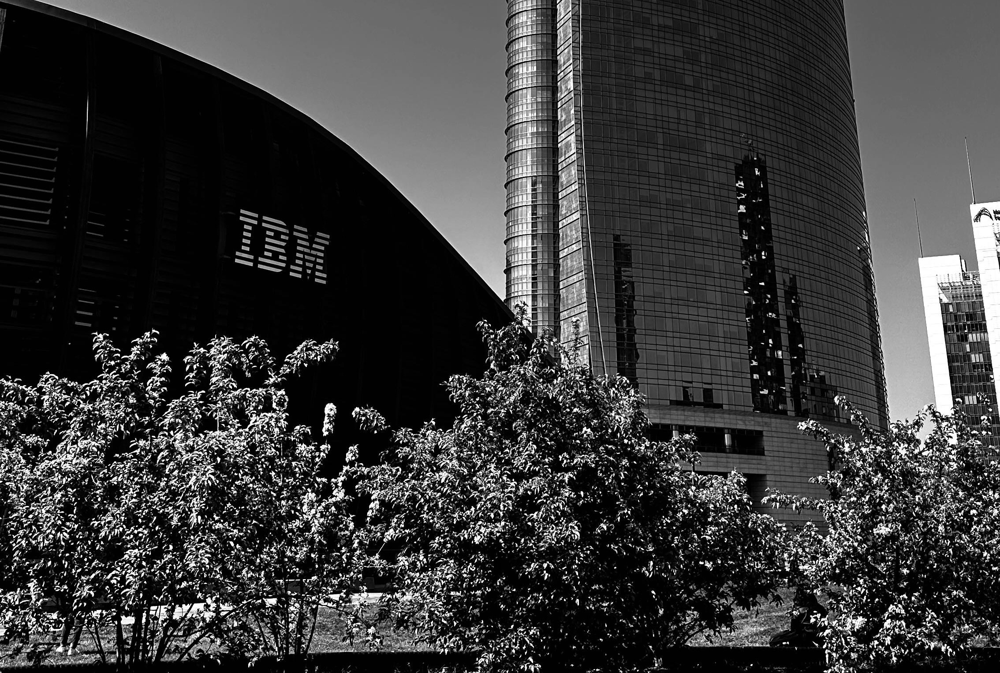

# IBM_Finance-Late_Payment_History

  

## 📌 Introduction :

A Finance Analyst working for 'The Big Bank' we have been tasked with finding out about our customers and their banking behaviour. Examine the accounts they hold and the type of transactions they make to develop greater insight into our customers.

## 🎯 Project Overview :

 ## **🛠️ Tools & Technologies Used** :
   

  

- BANK Database – Source of banks data

---

Here’s a concise *Project Overview, **Key Insights, and **Recommendations* based on the IBM Accounts Receivable dataset analysis provided in your project:

---

### 📘 *Project Overview*

This project involves an exploratory data analysis of *IBM’s Accounts Receivable dataset* consisting of 2,466 records. The primary goal is to understand customer payment behavior across different countries by analyzing:

* *Invoice amounts*
* *Days taken to settle invoices*
* *Payment delays (Days Late)*
* *Disputes*
* *Paperless billing impact*

Tools & libraries used: Python, Pandas, Seaborn, Matplotlib

---

### 📊 *Key Insights*

#### 1. *Customer Distribution by Country*

* Highest number of customers are from:

  * Country code 391 (616 customers)
  * 406 (561 customers)
  * 770 (506 customers)

#### 2. *Invoice Analysis*

* Average *Invoice Amount* across all countries: *\~\$59.90*
* Country 406 has the *highest average invoice amount: **\$70.27*
* Country 897 has the *lowest: **\$41.28*

#### 3. *Settlement Behavior*

* Overall average *Days to Settle: **\~26.44 days*
* Country 818 has the *longest average settlement time: **\~28.80 days*
* Customer 2621-XCLEH had the highest average *Days to Settle: **\~49.5 days*

#### 4. *Payment Delay (Days Late)*

* Overall average delay: *\~3.44 days*
* Country 818 had the highest delay: *\~4.82 days*
* Some customers like 0187-ERLSR and 9286-VLKMI had *0-day delay consistently*

#### 5. *Disputed Invoices*

* Invoices marked as *disputed* have significantly *higher average delays* compared to non-disputed ones

#### 6. *Paperless Billing Impact*

* Customers with *Paperless Billing* tend to have *lower payment delays*, indicating more efficiency

#### 7. *Monthly Trends*

* Invoices were distributed relatively evenly across months with some peaks; the bar chart shows billing seasonality.

---

### ✅ *Recommendations*

#### 1. *Focus on Paperless Adoption*

* Encourage customers to adopt *paperless billing* to reduce payment delays and improve cash flow.

#### 2. *Target High-Risk Customers*

* Monitor customers like 2621-XCLEH who consistently delay payments.
* Set up *automated reminders or stricter credit controls* for such clients.

#### 3. *Country-Specific Strategies*

* For country codes like 818 with high delays, investigate local payment practices and adapt credit policies accordingly.

#### 4. *Improve Dispute Resolution*

* Since disputed invoices result in higher delays, establish *faster dispute resolution mechanisms*.

#### 5. *Customer Segmentation*

* Classify customers based on average invoice amount and payment behavior for tailored engagement or incentives.

#### 6. *Forecasting & Planning*

* Use the time-series data (InvoiceMonth) to *forecast cash inflows* and plan working capital accordingly.

---

Would you like this summary formatted into a PPT or Word file?
